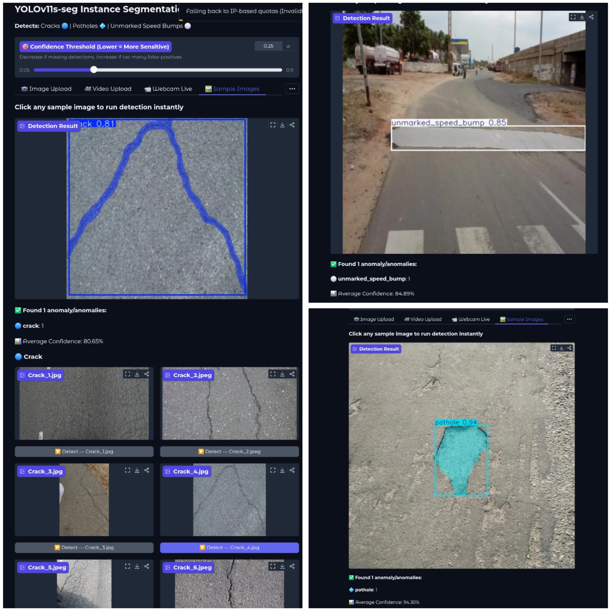

# Road-Anomaly-Detection-System
An instance segmentation system using YOLOv11s to detect and delineate road anomalies like potholes, cracks, and unmarked speedbumps. Features a Gradio web interface for interactive image and video inference.

### Key Features
* **Model:** YOLOv11s (State-of-the-art segmentation architecture).
* **Classes:** Potholes, Cracks, and Unmarked Speed Bumps.
* **Interface:** Interactive **Gradio** web UI for easy image and video testing.
* **Efficiency:** High-speed inference (~16ms) optimized for real-time applications.

---

## 📊 Model Performance
The model was trained on a custom dataset and validated on 156 test images. It achieved high accuracy, particularly in detecting unmarked speed bumps which are often difficult to identify.

| Class | Precision (P) | Recall (R) | mAP50 (Box) | mAP50 (Mask) |
| **All Classes** | **0.800** | **0.791** | **0.862** | **0.830** |
| Crack | 0.764 | 0.805 | 0.873 | 0.775 |
| Pothole | 0.796 | 0.734 | 0.813 | 0.813 |
| Unmarked Speed Bump | 0.840 | 0.835 | 0.899 | 0.900 |

* **Real-time Performance:** ~16ms inference on NVIDIA Tesla T4 GPU.

## 🚀 Live Demo
You can access the live web-based version of this model hosted on Hugging Face Spaces:
👉 **(https://huggingface.co/spaces/AruysJR/Road_Anomaly_Detection_System)**

---

## 📂 Repository Structure
* `app.py`: Main Gradio interface script.
* `best.pt`: Trained model weights.
* `/samples`: Demonstration images and video files.
* `requirements.txt` & `packages.txt`: Environment configuration for deployment.
## 🖼️ Detection Showcase
* 
